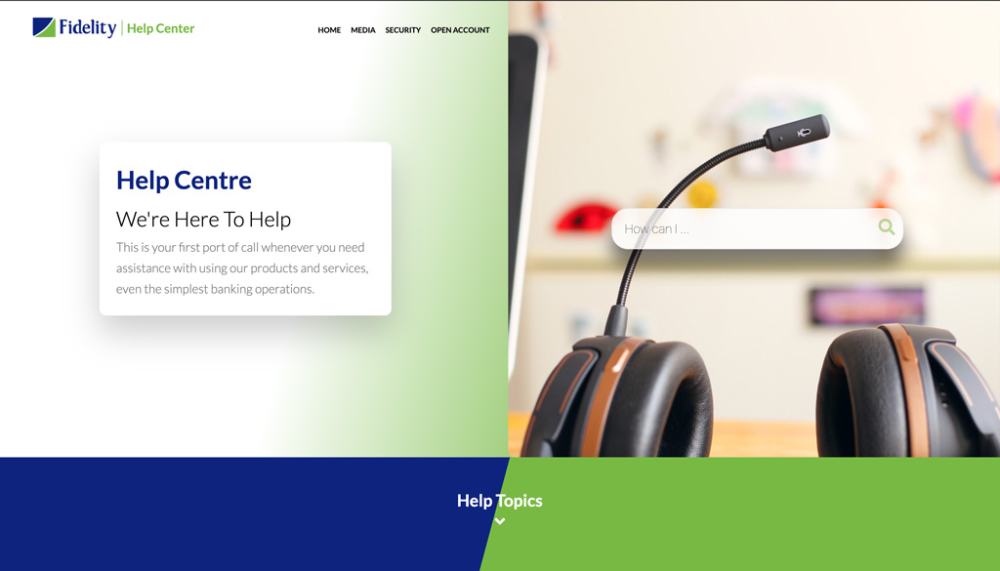
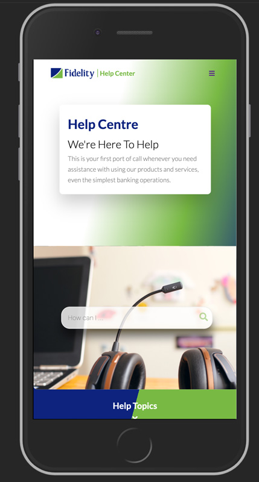

# Fidelity Bank Help Center UI Demo

> This project is to demo the UI for Fidelity Bank Helpdesk application.

## Built With

- HTML
- CSS
- Google Fonts
- FontAwesome
- SASS

## Live Demo

[Live Demo Link](https://acushlakoncept.github.io/fidelity-helpdesk/)

## Authors

**Uduak Essien**

- Github: [@acushlakoncept](https://github.com/acushlakoncept/)
- Twitter: [@acushlakoncept](https://twitter.com/acushlakoncept)
- Linkedin: [acushlakoncept](https://www.linkedin.com/in/acushlakoncept/)

## 🤝 Contributing

Contributions, issues and feature requests are welcome!

Feel free to check the [issues page](https://github.com/acushlakoncept/fidelity-helpdesk/issues).

## Show your support

Give a ⭐️ if you like this project!
